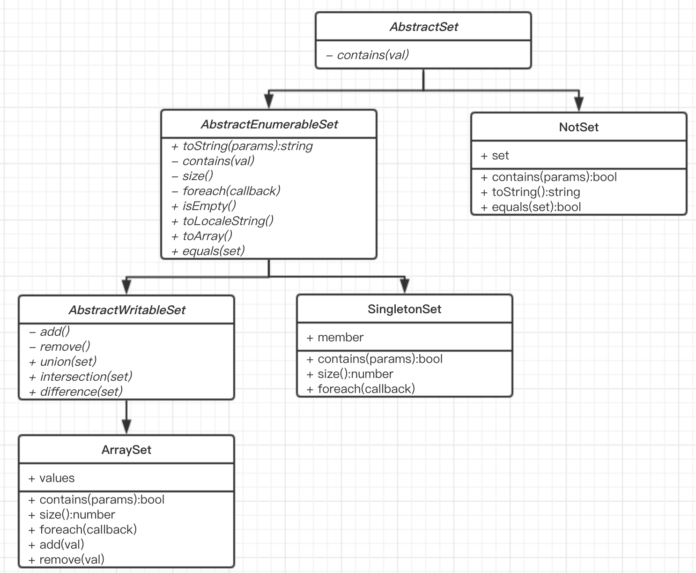

# 类和模块

```js
function inherit(o) {
    if(Object.create) {
        return Object.create(o);
    }
    if(typeof o === 'object' || typeof o === 'function') {
        return new TypeError();
    }
    function Construct() {}
    Construct.prototype = o
    return new Construct();
}

// 兼容IE的对象扩展函数
var extend = (function() {
   	for(var p in { toString: undefined }) {
        // 若in能识别toString，则走普通流程
        return function(o) {
            for(var i = 1; i < arguments.length; i++) {
                var item = arguments[i];
                // 参数为对象是才可以进行扩展操作
                if(typeof item === 'object') {
                    for(var prop in item) {
                        o[prop] = item[prop]
                    }
                }
            }
            
            return o;
        }
   	}
    
    var protoprops = ["toString", "valueOf", "constructor", "hasOwnProperty",
                      "isPrototypeOf", "propertyIsEnumerable", "toLocaleString"]
   	
   	return function(o) {
        for(var i = 1; i < arguments.length; i++) {
            var item = arguments[i];
            // 参数为对象是才可以进行扩展操作
            if(typeof item === 'object') {
                for(var prop in item) {
                    o[prop] = item[prop]
                }
            }
            
            for(var j = 0; j < protoprops.length; j++) {
               	var prop = protoprops[j];
                if(item.hasOwnProperty(prop)) {
                    o[prop] = item[prop]
                }
            }
        }
        return o;
   	}
   	
}())
```

这是之前章节讲过的用于继承的函数和用于扩展对象的函数，本章时常会用到这两个方法

## 类和原型

类的所有实例都是从一个原型对象上继承属性的

一个简单的类

```
// range：实现一个能表示值的范围的类
// 工厂模式返回一个新的“范围对象”
function range(from, to) {
   var o = inherit(range.methods);
   o.from = from;
   o.to = to;
   return o;
}
range.methods = {
    includes: function(x) {
        return x >= this.from && x <= this.to
    },
    foreach: function(f) {
        for(var i = Math.ceil(this.from); i <= this.to; i++) {
            f(i)
        }
    },
    toString: function() {
        return "(from" + this.from + "... to " + this.to + ")"
    }
}

var r = range(1.0, 5);
r.includes(2);		// 返回true
r.foreach(console.log);	// 输出1 2 3
console.log(r)	// 输出{from: 1.0, to: 5}
```

依据某个对象作为原型对象产生新对象的函数是类

## 类和构造函数

大部分情况，使用工厂函数定义类这种方式不是很常见，我们更多的使用构造函数来定义类。

```
// 工厂函数改为构造函数
function Range(from, to) {
    this.from = from;
    this.to = to;
}
Range.prototype = {
    includes: function(x) {
        return x >= this.from && x <= this.to
    },
    foreach: function(f) {
        for(var i = Math.ceil(this.from); i <= this.to; i++) {
            f(i)
        }
    },
    toString: function() {
        return "(from" + this.from + "... to " + this.to + ")"
    }
}
var r = new Range(1.0, 5);
r.includes(2);		// 返回true
r.foreach(console.log);	// 输出1 2 3
console.log(r)	// 输出{from: 1.0, to: 5}
r instanceof Range	// 返回为true，说明r是Range的实例
```

构造函数和类的标识

原型对象是类的唯一标识：当且仅当两个对象继承自同一个原型对象时，它们才是属于同一个类的实例

构造函数是类的“外在表现”：构造函数的名称通常作为类名

```
r instanceof Range	// 如果r继承于Range.prototype,则返回为true
```

### constructor属性

每一个定义的函数都有prototype属性，constructor是prototype中的一个属性，指向构造函数

```
function F() {};
F.prototype.constructor === F		// 返回为true
var f = new F();
f.constructor === F					// 返回为true，由构造函数创建的实例对象默认附带指向构造函数的										// constructor属性
```

自定义函数的prototype时，如果不设置constructor值，则constructor不再指向函数本身

```
// 之前我们定义的Range函数
Range.prototype.constuctor === Range	// 返回为false，因为Range函数自定义了prototype
										// 且未设置constructor属性值
```

如何优化

- 方案1.在自定义prototype时，设置constructor值

  ```js
  function Range(from, to) {
  
          this.from = from;
  
          this.to = to;
  
      }
  
      Range.prototype = {
  
          constructor: Range,			// 设置constructor属性值
  
          includes: function(x) {
  
              return x >= this.from && x <= this.to
  
          },
  
          foreach: function(f) {
  
              for(var i = Math.ceil(this.from); i <= this.to; i++) {
  
                  f(i)
  
              }
  
          },
  
          toString: function() {
  
              return "(from " + this.from + "... to " + this.to + ")"
  
          }
  
      }
  ```

- 方案2.prototype不再自定义，而是添加属性

  ```js
  function Range(from, to) {
  
          this.from = from;
  
          this.to = to;
  
      }
  
      Range.prototype.includes = function(x) {
  
      	return x >= this.from && x <= this.to
  
      };
  
      Range.prototype.foreach = function(f) {
  
          for(var i = Math.ceil(this.from); i <= this.to; i++) {
  
              f(i)
  
          }
  
      };
  
      Range.prototype.toString = function() {
  
          return "(from " + this.from + " ... to " + this.to + ")"
  
      }
  
  ```

- 用处：检查对象是否属于某个类

  ```js
  function checkClass(o, c) {
      return o.constructor === c
  }
  
  var o = [];
  checkClass(o, Array)	// 判断o对象是否属于Array类型，判断是否为数组的一种方式
  ```


### 构造函数的名称

## 类和类型

本章介绍如何判断对象是否属于某个类型，我们使用函数来表示对象的类型

### instanceof运算符

`对象 instanceof 函数`

```js
function F() {};
var o = new F();
o instanceof F		// 返回为true
o instanceof Object	//	返回为true，instanceof 可以体现继承关系，F类型是继承与Object类型的
```

缺陷：多个上下文的前提下，每次用函数定义的类型都是不同的类型，无法用instanceof来判断两个上下文中定义的类型，这种情况存在与iframe嵌套页面的时候

### constructor属性

作用：

- 判断对象是否属于某个类型

```js
function F() {};
var o = new F();
o.constructor === F		// 返回为true
```

- 区分对象和数组

  ```js
  function isArray(o) {
      return o.constructor === Array
  }
  ```

缺陷：

- 不是所有的对象都有constructor属性的。

### 构造函数的名称

```js
Function.prototype.getName = function() {
    // 一些浏览器会给函数对象附带内置属性name，通过name属性可以获取函数名
    if('name' in this) return this.name;
    // 如果不带此属性，则通过toString方法返回的值正则匹配得到
    // Function类的toString函数返回值格式为：
    
    
    // function funcName() { ... }
    return this.toString().match(/function\s*([^(]*)/)[1]
}
```

缺陷：

- 函数不一定有名称，比如说匿名函数

### 鸭式辩型

之前我们想用构造函数的名称、instanceof、constructor等来明确对象的类型，但是有这样或那样的缺陷在。

解决方案就是规避掉这些问题：`不要关注“对象的类是什么”，而是关注“对象能做什么”`

鸭式辩型就是典型的此类思想：`像鸭子一样走路，游泳并且嘎嘎叫的鸟就是鸭子`

JavaScript中此类思想的引用：`如果一个对象可以像鸭子一样走路、游泳并且嘎嘎叫，就认为这个对象是鸭子，哪怕它不是从鸭子类的原型对象继承而来`

```js
function Duck() {
    
}
Duck.prototype = { 
    ...Duck.prototype, 
    step: function() { console.log("") },
    swim: function() {},
    shout: function() {}
}
var trueDuck = new Duck();	// trueDuck有构造函数创建
// falseDuck是自定义的对象，和Duck类没有直接关系，但是它实现了Duck类实例对象中定义的所有同名方法
// 我们认为falseDuck也是一个Duck类型的对象
var falseDuck = {
    step: function() {},
    swim: function() {},
    shout: function() {}
}
```

#### 利用鸭式辩型判断对象是否属于类型

```js
function quacks(o	/*, ... */) {
    for(var i = 1; i <= arguments.length; i++) {
        var arg = arguments[i];
        switch(typeof arg){
            case 'string':
                if(typeof o[arg] !== 'function') return false;
            case 'function':
                arg = arg.prototype;	// 如参数为函数，则取函数的原型对象作为鸭式辩型判断依据
            case 'object':
                for(var p in arg) {		
                    // 这里for in只能遍历arg的自有属性，若想更严格地验证继承链上的函数，
                    // 则可以使用ES5提供的getpropertyNames()方法
                    if(typeof arg[p] !== 'function') continue;
                   	if(typof o[p] !== 'function') return false
                }
            
        }
        
    }
    
    return true;
}

quacks(falseDuck, Duck)		// 鸭式辩型思想下，falseDuck属于Duck类型
```

## JavaScript中的面向对象技术

本章将介绍如何利用类进行变成。

### 例1：集合类

集合（Set）是一种数据结构，用以表示非重复值的无序集合

```js
// 集合的构造函数
function Set() {
    this.values = {};	// 集合数据保存在对象的属性里
    this.length = 0;	// 集合中值的个数
    this.add.apply(this, arguments);
}

Set.prototype.add = function() {
    for(var i = 0; i < arguments.length; i++) {
        var val = arguments[i];
        var key = Set._v2s(val);
        if(!this.values.hasOwnProperty(key)) {
            this.values[key] = val;
            this.length ++;
        }
    }
    
    return this;		//	支持链式调用
}

Set.prototype.remove = function() {
    for(var i = 0; i < arguments.length; i++) {
        var val = arguments[i];
        var key = Set._v2s(val);
        if(this.values.hasOwnProperty(key)) {
            delete this.values[key];
            this.length --;
        }
    }
    
    return this			// 支持链式调用
}

Set.prototype.containers = function(value) {
    var key = Set.v2s(value);
    return this.values.hasOwnProperty(key);
}

Set.prototype.forEach = function(callback) {
    var index = 0;
    for(var key in this.values) {
        callback(this.values[key], index++)
    }
}

Set._v2s = function(o) {
    switch(o) {
        case undefined: return 'u';
        case null: return 'n';
        case true: return 't';
        case false: return 'f';
        default:
            if(typeof o === 'object') {
                return '@' + objectId(o)
            } else if(typeof o === 'string') {
                return "'" + o;
            } else if(typeof o === 'number') {
                return '#' + o
            }
    }
    
    function objectId(o) {
        var prop = '|**objectId**|';	// 此方法向对象o中塞入了私有属性
        if(!o.hasOwnProperty(prop)) {	// 对象o是否已经被设置了此属性
            o[prop] = Set._v2s.id ++;	// 若没有设置，塞入此属性，并递增属性值
        }
        
        return	o[prop]
    }
}

Set._v2s.id = 1;
```

### 例2：枚举类型

枚举类型是值的有限集合，若值定义为这个类型则该值是可列出的。

```js
// 工厂类型，返回枚举类
function enumeration(props) {
    // 返回的类型是不可作为构造函数的
    var enumeration = function() { throw "Can't Instantiate Enumerations" }
   
    // 定义枚举类的原型对象
    var proto = enumeration.prototype = {
        constructor: enumeration,
        toString: function() { return this.name },
        valueOf: function() { return this.value },
        toJSON: function() { return this.name }
    }
    
    enumeration.values = [];
    for(name in props) {
        // 以枚举类的原型对象为props对象的每一个属性创建继承对象
    	var o = inherit(proto);
        o.name = name;
       	o.value = props[name];
        enumeration.values.push(o);
       	enumeration[name] = o;
    }
    
    // 实现枚举类的遍历静态方法
    enumeration.foreach = function(f, c) {
        for(var i = 0; i < this.values.length; i++) {
            f && f.call(c, this.values[i])
        }
    }
    
    return enumeration;
}

// 使用枚举类
var Coin = enumeration({ Penny: 1, Nickel: 5, Dime: 10, Quarter: 25 })
Coin.Dime instanceof Coin		// 返回为true，作为参数的属性都是Coin的实例
```


```js
// 实例枚举类定义一副扑克牌
function Card(suit, rank) {
	this.suit = suit;
    this.rank = rank;
}

// 定义的卡牌的花色和数值
Card.Suit = enumeration({ Clubs: 1, Diamonds: 2, Hearts: 3, Spades: 4 })
Card.Rank = enumeration({ Two: 2, Three: 3, Four: 4, Five: 5, Six: 6, 
                          Seven: 7, Eight: 8, Nine: 9, Ten: 10,
                          Jack: 11, Queen: 12, King: 13, Ace: 14})
Card.prototype.toString = function() {
    return this.suit + " of " + this.rank
}
// 普通卡牌点数比较
Card.prototype.compareTo = function(that) {
   	if(this.rank > that.rank) return 1;
    if(this.rank == that.rank) return 0;
    if(this.rank < that.rank) return -1;
}
// 桥牌模式的卡牌点数比较
Card.prototype.compareToWithSuit = function(that) {
    if(this.suit > that.suit) return 1;
    if(this.suit < that.suit) return -1;
    if(this.rank > that.rank) return 1;
    if(this.rank < that.rank) return -1;
    if(this.rank == that.rank) return 0;
}
Card.orderByRank = function(a, b) { return a.compareTo(b) }

Card.orderBySuit = function(a, b) { return a.compareToWithSuit(b) }

// 定义一副标准扑克牌
function Deck() {
    var cards = this.cards = [];
    Card.Suit.foreach(function(suit) {
        Card.Rank.foreach(function(rank) {
            cards.push(new Card(suit, rank))
        })
    })
}

// 洗牌
Deck.prototype.shuffle = function() {
   	var cards = [...this.cards];
    for(var i = 0; i < cards.length; i++) {
    	var toChangeIndex = Math.floor(Math.random() * cards.length + 1);
        var temp = cards[toChangeIndex];
        cards[toChangeIndex] = cards[i];
        cards[i] = temp;
    }
    this.cards = cards;
    return this
}

Deck.prototype.deal = function(n) {
    if(!n && typeof n !== 'number') throw "illegal parameter"
    if(n > this.cards.length) throw "Out of cards";
    return this.cards.splice(this.cards.length - n - 1, n);
}

var deck = (new Deck()).shuffle();
var hand = deck.deal(2).sort(Card.sortBySuit);
```

### 标准转换方法

#### toString

返回一个可以表示这个对象的字符串

- 如果没有定义toString方法，将会返回"[Object object]"，这个字符串用处不大
- 自定义toString方法，并返回一个可读的字符串，可以让程序变得易于调试

#### toLocaleString

以本地敏感性（locale-sensitive）的方式来将对象转换为字符串。

- 对象继承的toLocaleString方法只是简单地调用toString方法

- 一些内置类已经自定义了toLocaleString，例如Date。

  ```js
  var d = new Date();
  d.toLocaleString() 		// 返回类似于"2018/6/4 下午7:52:19"的字符串
  d.toString()			// 返回类似于"Mon Jun 04 2018 19:52:19 GMT+0800 (中国标准时间)"字符串
  ```

#### valueOf

将对象转换为原始值。

#### toJSON

toJSON方法是JSON.stringify()自动调用的方法，用来生成JSON格式的字符串。

- 若对象没有toJSON方法，JSON.stringify将调用制定的toJSON方法序列化对象

  ```js
  JSON.stringify({ a: 1, b: 2 })		// 返回
  ```

- 对象自定义toJSON方法后，JSON.stringify将直接调用toJSON方法，并返回

  ```js
  var o = {};
  o.toJSON = function() { return 'zzzz' }
  JSON.stringify(o)		//	返回""zzzz""，前后分别多双引号
  ```

- Date对象的toJSON方法直接返回时间格式字符串

  ```js
  var d = new Date();
  JSON.stringify(d)		// 返回""2018-06-04T11:52:19.093Z""
  ```

### 方法借用

实例方法有时候是直接指向其他对象中的方法的，这种方式称为“方法借用”，也成为“多重继承”。

### 私有状态

### 构造函数的重载和工厂方法

- 构造函数的`重载`是指：在构造函数内部进行属性或方法的初始化

## 子类

方法链：子类C的实例从父类P中继承了所有的实例方法，子类C可以定义自己的实例方法，有些方法可以重载父类P中的同名方法，C中的重载方法中可能会去调用P类中的重载方法，这种做法称为”方法链“

### 定义子类

```js
// 使类B继承于类A
B.prototype = inherit(A.prototype)		// 子类的原型对象派生自父类
B.prototype.constructor = B				// 重载继承来的constructor属性
```


```js
// 实现简单的函数用于创建简单的子类
function defineSubclass(superclass, 		// 父类的构造函数
                        constructor, 		// 子类的构造函数
                        methods, 			// 子类的实例方法
                        statics) {			// 子类的类属性
    constructor.prototype = inherit(superclass.prototype);
    constructor.prototype.constructor = constructor;
    
    if(methods) extend(constructor.prototype, methods);
    if(statics) extend(constructor, statics);
    
    return constructor;
}
// 更喜欢类似SuperClass.extend(ChildClass, methods, statics)的对象方法调用方式
Function.prototype.extend = function(constructor, methods, statics) {
    return defineSubclass(this, constructor, methods, statics)
}
```

```js
// 创建Set的子类SingletonSet
// SingletonSet是一个特殊的集合，它是只读的，而且含有单独的常量成员
function SingletonSet(x) { this.member = x }
defineSubclass(Set, SingletonSet, {
    add: function() { throw "read-only set" },
    remove: function() { throw "read-only set" },
    size: function() { return 1 },
    foreach: function(f, context) {f.call(context, this.member)},
    containers: function(x) { return this.member === x }
})
```

### 构造函数和方法链

子类的构造函数可能会去调用父类的构造函数和父类方法，这形成了调用的方法链。

```js
// 一个特殊的集合，不允许null和undefined作为它的成员
function NotNullSet() {
    // 直接调用父级Set的构造函数初始化
    Set.apply(this, arguments)
}

defineSubclass(Set, NotNullSet, {
    add: function() {
        // 遍历参数排查是否存在null或者undefined
        // 若存在，则直接抛出异常
        for(var i = 0; i < arguments.length; i++) {
            if(arguments[i] === null || arguments[i] === undefined) 
                throw new Error("Can not add null or undefined to NotNullSet");
        }
        
        // 调用父级类的实例方法add
        return Set.prototype.add.apply(this, arguments);
    }
})
```

NotNullSet其实是在Set类的基础上重载了add方法，加了一层过滤。上诉模式下，如果集合的元素过滤条件需要更改时，我们又需要去创建一个新的子类，比较麻烦。比如说，我们需要一个只存字符串类型值的集合。`如何优化？`

```js
// 定义一个类工厂函数，根据集合元素过滤条件的不同，产生新的子类
function filteredSetSubclass(superclass, filter) {
    if(!superclass || typeof superclass !== 'function') throw new Error("superclass should be a function")
    var subclass = function() {
        superclass.apply(this, arguments)
    };
    superclass.extend(subclass, {
        add: function() {
            for(var i = 0; i < arguments.length; i++) {
                var source = arguments[i]
                if(!filter(source)) 
                    throw new Error(source + ' is rejected by filter')
            }
            superclass.prototype.add.apply(this, arguments);
        }
    })
    return subclass;
}

// 作为Set类的静态方法，减少方法调用使用的参数
Set.filteredSubClass = function(filter) {
    return filteredSetSubclass(Set, filter)
}
```

**使用类工厂函数得到只能保存字符串的集合**

```js
// 通过类工程函数来得到新的子类，很简介
// 究其原因，我们总结得到了子类定义的规律
var StringSet = Set.filteredSubClass(function(val) {
    return typeof val === 'string'
})

var NotNullSet = Set.filteredSubClass(function(val) {
    return val !== null && val !== undefined
})
```

### 组合 vs 子类

组合的操作参数不是类，而是对象，根据原对象封装出新的对象。

```js
// 创建一个组合类，这个类的构造方法接收Set类型对象
// 构造方法执行后将对Set对象进行封装
function FilterSet(set, filter) {
    this.set = new Set();
    this.filter = filter;
    
    // 将set对象存储的值转储于this.set中
    var self = this;
    set.forEach(function(val) {
        self.add(val)
    })
    
    this.values = this.set.values;
}
// 复用Set类的所有原型方法
for(var p in Set.prototype) {
    var source = Set.prototype[p]
    if(typeof source === 'function') {
        FilterSet.prototype[p] = function() {
            return this.set[p].apply(this.set, arguments)
        }
    }
}
// 重写Set的add方法
FilterSet.prototype.add = function() {
    for(var i = 0; i < arguments.length; i++) {
        var source = arguments[i]
        if(!this.filter(source)) 
            throw new Error(source + ' is rejected by filter')
    }
    this.set.add.apply(this.set, arguments)
}
```

**`组合优于继承`**

```js
// FilterSet拥有Set类中的所有方法
var fs = new FilterSet(new Set(1, 2, 3), function() {return true})
// 可以多次组合直到得到需要的结果
var filterSet = new FilterSet(fs, function() { return true })
// 显然通过组合的成本比继承的成本小得多
```

###类的层次结构和抽象类

这一小节，我们像Java一样去定义一些抽象类，之前我们写的Set将再次登场



这是我们将要实现的类

```js
function abstractMethod() { throw new Error("abstract method") }
```


`AbstractSet`：抽象集合类，定义Set类型必须要定义contains同名方法

```js
function AbstractSet() {
    throw new Error('can not instantiate abstract class')
}
AbstractSet.prototype.contains = abstractMethod;
```

`NotSet`：非抽象集合类，是一个组合类，实现了集合必须要有的contains方法，是常规contains方法的取反操作

```js
var NotSet = AbstractSet.extend(function NotSet(set) {
    this.set = set;
}, {
    contains: function(val) {
        return !this.set.contains(val)
    },
    toString: function() {
        return '~' + this.set.toString();
    },
    equals: function(that) {
        return that instanceof NotSet && this.set.equals(that.set)
    }
})
```

`AbstractEnumerableSet`：可遍历集合抽象类，定义一个集合可遍历需要定义的一些方法，已经实现了可遍历集合的通用方法。

```js
var AbstractEnumerableSet = AbstractSet.extend(
	function() { throw new Error('can not instantiate abstract class') },
    {
        size: abstractMethod,
        foreach: abstractMethod,
        isEmpty: function() {
            return this.size() === 0;
        },
        // 历的时候取值进行字符串拼接，格式例如[1,2,3,4]
        toString: function() {
           	var content = "[";
            this.foreach(function(val) {
                content += val + ',';
            })
           	return content.substring(0, content.length - 1) + ']' 
        },
        // 遍历的时候取值的toLocaleString进行拼接
        toLocaleString: function() {
            var content = "[";
            this.foreach(function(val) {
                content += val.toLocaleString() + ',';
            })
           	return content.substring(0, content.length - 1) + ']' 
        },
        toArray: function() {
            var arr = [];
            this.foreach(function(val) {
                arr.push(val)
            })
            return arr;
        },
        equals: function(that) {
            if(that.size() !== this.size()) return false;
            var arr = this.toArray();
            var result = true;
            that.foreach(function(val) {
                if(arr.indexOf(val) < 0) {
                    result = false;
                }
            })
            return result;
        }
    }
)
```

`SingletonSet`：只有一个元素的可遍历集合

```js
var SingletonSet = AbstractEnumerableSet.extend(
    function SingletonSet(member) {
        this.member = member;
    },
    {
        contains: function(val) { return this.member === val },
        foreach: function(callback) { callback(this.member) },
        size: function() { return 1 }
    }
)
```

`AbstractWritableSet`：可以进行编辑操作的可遍历集合

```js
var AbstractWritableSet = AbstractEnumerableSet.extend(
	function() { throw new Error('can not instantiate abstract class') },
    {
        add: abstractMethod,
        remove: abstractMethod,
        union: function(that) {
            // 取并集
            var self = this;
            that.foreach && that.foreach(function(val) {
             	self.add(val)
            })
            return this;
        },
        intersection: function(that) {
            // 删除公有元素
            var self = this;
            that.foreach && that.foreach(function(val) {
                if(self.contains(val)) self.remove(val);
            })
            return this;
        },
        difference: function(that) {
            // 删除公有元素
            var self = this;
            that.foreach && that.foreach(function(val) {
                self.remove(val);
            })
            return this;
        }
    }
)
```

`ArraySet`：数组集合，用数组的方式实现元素的储存

```js
var ArraySet = AbstractWritableSet.extend(
    function ArraySet() {
        this.values = [];
        this.add.apply(this, arguments);
    },
    {
        foreach: function(callback) { 
            for(var i = 0; i < this.values.length; i++) {
                callback(this.values[i])
            }
        },
        add: function() {
            for(var i = 0; i < arguments.length; i++) {
                if(!this.contains(arguments[i]))
                    this.values.push(arguments[i])
            }
    
    		return this;		//	支持链式调用
        },
        remove: function() {
            for(var i = 0; i < arguments.length; i++) {
                if(this.contains(arguments[i])) {
                    this.values.splice(this.values.indexOf(arguments[i]), i);
                }
            }
            return this;
        },
        contains: function(val) {
            var isExist = false;
            this.foreach(function(v) {
                if(val === v) isExist = true;
            })
            return isExist;
        },
        size: function() { return this.values.length }
    }
)
```

## ECMAScript 5中的类

ES5给属性特性添加了方法支持（getter、setter、可枚举性、可写性、可配置性），而且增加了对象可扩展性的限制。

###让属性不可枚举

有时候我们需要去定义一个私有属性，不希望外界通过简单的遍历就能获取到属性值

```js
var o = {};
Object.defineProperty(o, '_id', {
    value: 1,
    enumerable: false
})
for(var p in o) { console.log(p) }		// 没有打印出'_id'
```

 **定义一个可以测试**

