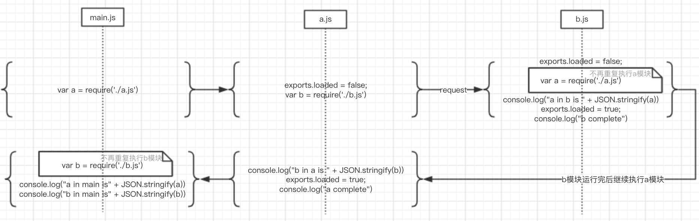
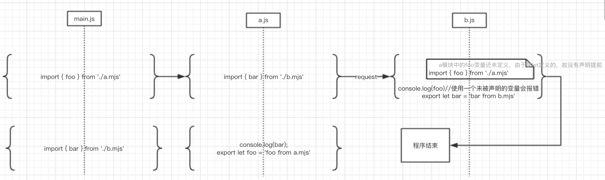
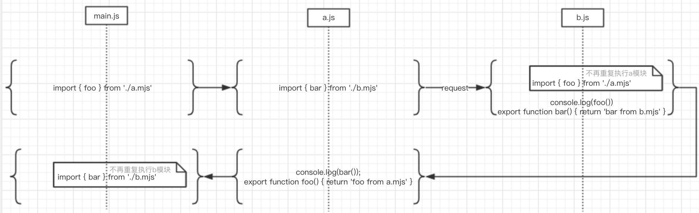

# ES6与CommonJS中的模块处理

ES6和CommonJS都有自己的一套处理模块化代码的措施，即JS文件之间的相互引用。

为了方便两种方式的测试，使用nodejs的环境进行测试

##CommonJS的模块处理

使用require来引入其他模块的代码，使用module.exports来引出

```js
// exportDemo.js
count = 1;
module.exports.count = count;
module.exports.Hello = function() {
  var name;
  this.setName = function(newName) {
    name = newName;
  }
  this.sayHello = function() {
    console.log("hello Mr." + name);
  }
  this.getId = function() {
    return count++
  }
}
```

```js
// requireDemo.js
var {Hello} = require("./exportDemo")
var hello = new Hello();

hello.setName("Blank");
hello.sayHello();
```

在终端执行`node requireDemo.js`，返回结果为'hello Mr.Blank'

**导出的Hello函数是原函数的一次拷贝，修改Hello函数的属性值不会对其他require的地方造成影响**

```js
var { Hello, count } = require('./exportDemo')
var hello = new Hello();
// 让count自增
console.log(hello.getId());
console.log(hello.getId());
// 发现获取的count还是原值
console.log(count)

// 真正的count其实是已经改了的
var newHello = new Hello();
console.log(newHello.getId())

var { Hello: newHello, count: newCount } = require('./exportDemo')
console.log(newCount, 'newCount');
// 再次require，取得的newHello和之前require的Hello指向同一个拷贝
console.log(newHello === Hello) 
```


## ES6的模块处理

### nodejs中运行ES6风格的代码

nodejs默认是不支持ES6的模块处理方案的。

但是在8.5.0之后，ES6代码的文件格式定为mjs后，可使用`node --experimental-modules xxx.mjs`运行。

```js
// exportDemo.mjs
export let a = 1;
```

```js
// importDemo.mjs
import {a} from './exportDemo.mjs'
console.log(a)
```

### 与CommonJS模块处理的区别

* CommonJS 模块输出的是一个值的拷贝（已在上一章验证），ES6 模块输出的是值的引用。

  ```js
  // exportDemo.mjs
  export let counter = 1;
  export function incCounter() {
    counter ++;
  }
  ```

  ```js
  // importDemo.mjs
  import { counter, incCounter } from './exportDemo.mjs'
  
  incCounter();
  console.log(counter)		// 打印结果为2，而不是初始值的1
  ```

* CommonJS模块是运行时加载，ES6模块是编译时输出接口

  * Nodejs此类的运行环境会在一个闭包中运行CommonJS模块代码

    ```js
    (function(exports, require, module, __filename, __dirname) {
    // Module code actually lives in here
    });
    ```

  * ES6 模块不会缓存运行结果，而是动态地去被加载的模块取值，并且变量总是绑定其所在的模块。

    ```js
    // exportDemo.mjs
    export let a = 1;
    export const b = 2;
    export let obj = {};
    
    // importDemo.mjs
    import { a, b } from './exportDemo.mjs'
    console.log(a, b)
    a = 1 // 报错，TypeError: Assignment to constant variable，export出来的值是一个只读引用
    obj.x = 1	// 可以改变属性值
    ```

    **在ES6模块中我们更多地要去考虑语法的问题**

### export default

有时候我们会在代码发现`export default obj `的用法，那么这个default是用来干嘛的?

**default是ES6引入的与export配套使用的关键字，用来给匿名对象、匿名函数设置默认的名字用的**

**export出来的值必须要有一个命名，否则从语法层次便会报错**

让我们看一下以下几个会报错的错误例子

* export匿名对象

  ```js
  export { x: 1 }	// 报错，SyntaxError:Unexpected token，这是一个编译阶段的错误
  
  // 正确写法
  export default { x: 1 }
  ```

* export匿名函数

  ```js
  export function() {}	// 报错，SyntaxError: Unexpected token (
  
  // 正确写法
  export default function() {}
  ```

  


## 循环引用（recycling loading）

在复杂的模块中，可能会出现模块间的**互相引用**。

###commonJS的循环引用运行机制

```js
// a.js
exports.loaded = false;
var b = require('./b.js')
console.log("b in a is " + JSON.stringify(b))
exports.loaded = true;
console.log("a complete")
```

```js
// b.js
exports.loaded = false;
var a = require('./a.js')
console.log("a in b is " + JSON.stringify(a))
exports.loaded = true;
console.log("b complete")
```

```js
// main.js
var a = require('./a.js')
var b = require('./b.js')

console.log("a in main is" + JSON.stringify(a))
console.log("b in main is" + JSON.stringify(b))
```

执行指令`nodejs main.js`

时序图下的执行步骤分解图如下所示：



### ES6的循环引用运行机制

*  一个会报错的例子

  ```js
  // a.mjs
  import { bar } from './b.mjs'
  
  console.log(bar);
  export let foo = 'foo from a.mjs'
  ```

  ```js
  // b.mjs
  import { foo } from './a.mjs'
  
  console.log(foo)
  
  export let bar = 'bar from b.mjs'
  ```

  ```js
  // main.mjs
  import { foo } from './a.mjs'
  import { bar } from './b.mjs'
  ```

  `node main.mjs`

  

  ES6的循环引用要特别注意变量是否已被声明，若未被声明的块级作用域变量被其他模块引用时，会报错。

* 改进方案：循环引用中尽量去export可以提前确定的值（例如函数），其实我们总是希望去**引用模块执行完全后最终确定的变量**。

  ```js
  // a.mjs
  import { bar } from './b.mjs'
  
  console.log(bar());
  export function foo() {
      return 'foo from a.mjs'
  }
  ```

  ```js
  // b.mjs
  import { foo } from './a.mjs'
  console.log(foo());
  export function bar() {
      return 'bar from b.mjs'
  }
  ```

  ```js
  // main.mjs
  import { foo } from './a.mjs'
  import { bar } from './b.mjs'
  ```

  `node main.mjs`

  返回结果:

  ```js
  foo from a.mjs
  bar from b.mjs
  ```

  


