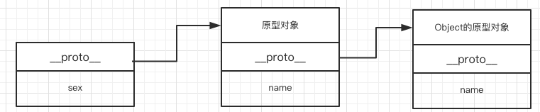
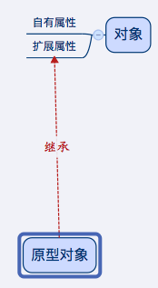
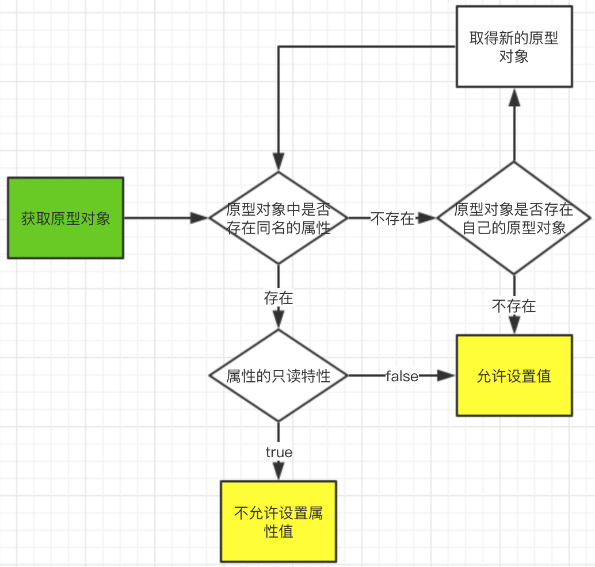

# 对象

## 创建对象

### 对象直接量

**注意点：**

* ES5中保留字可以用作不带引号的属性名，而ES3中，保留字作为属性名必须使用引号引起来

  ```js
  var o = { var: 1 } 		// ES5+支持的写法
  var o = { "var": 1 } 	// ES3支持的写法
  ```

* 对象直接量是一种表达式，表达式的运算会创建并初始化一个新的对象。

### 通过new创建对象

格式1(内置构造函数)：

```js
var variable = new Object();
var a = new Array();
var d = new Date();
var r = new RegExp("js");
```

格式2（自定义构造函数）：

```js

function contruct1() {
	this.id = 1
}
var o = new contruct1();
console.log(o); 			//打印出contruct1 {id: 1}
```

### 通过原型创建对象

**构造函数的原型链**


```js
function F(){
    this.name = 'zhang';
};
var f1 = new F();
var f2 = new F();
F.prototype.__proto__ === Object.prototype // 输出为true
f1.__proto__ === F.prototype // 输出为true
```

**Object.create静态方法产生的原型链**

```js
var o = Object.create({name: 'test'})
o.sex = '男'
```



**没有原型的对象**

* null是一个没有原型的对象
* Object.create(null)将产生没有原型的对象

**使用原型来继承创建一个新对象**

```js
function inherit(p) {
    if(Object.create)
        return Object.create(p);
    var t = typeof p;
    if(t !== 'object' && t !== 'function') 
        throw TypeError();
    function newConstruct() {}
    newConstruct.prototype = p;
    return new newConstruct();
}
```

通过修改原型属性可以来修改对象的继承关系

## 属性的查询和设置

### 数组形式

```js
var o = { name: 'test' }
o["name"] 			// 取值
o["name"] = 'zsf'	// 设值
```

**通过方法来给对象参数设置属性值**

```js
function setProp(prop) {
    prop["name"] = "zhangsf"
}
setProp(o);
```

### 继承



### 属性设置的检查流程

对象中定义与原型对象相同的属性名，将会经过以下步骤：



### 属性访问错误

原因：undefined和null赋值的变量取其属性的时候会报**属性访问错误**

```js
var nullVar = null;
var undefinedVar = undefined;
nullVar.xx 						
// 报错:Uncaught TypeError: Cannot read property 'xx' of null
undefinedVar.xx 				
// 报错:Uncaught TypeError: Cannot read property 'xx' of undefined
```

**如何避免这类错误？**

在赋值之前进行判断

* 简洁的判断+赋值语句

  ```js
  param && param.xxx
  ```

## 删除属性

* delete运算符只能删除自有属性，不能删除继承属性
* 无法删除var定义的变量；
* 无法删除function声明的全局函数

## 检测属性

### in运算符

```js
var o = { x: 1 }
"x" in o 		// 判断o对象中是否存在名为x的属性，返回为true
"y" in o		// 返回为false，
"toString" in o // 返回为true，toString属性继承于原始对象Object
```


`in运算符判断左操作数是否为右操作数的自有属性或继承属性`

### hasOwnProperty()

```js
var o = { x: 1 }
o.hasOwnProperty("x")			// 返回为true
o.hasOwnProperty("toString") 	// 返回为false，toString是继承属性
```


`hasOwnProperty是继承于Object原始对象的方法，用来判断是否为自有属性`

### propertyIsEnumerable

```js
var o = { x: 1 } 
Object.defineProperty(o, 'y', { value: 2, enumerable: false })
// 定义一个不可枚举的属性y
o.propertyIsEnumerable('y')  
//返回false，表明y属性是不可枚举或者不属于对象o
```

###直接判断

```js
var o = {x: 1, y: undefined}
o.x !== undefined 		//	这种情况只能判断其中的值是否为undefined
o.y !== undefined		// 返回为false，y其实是存在的，但是其值为空，没有意义，在不计较“空值”和“不存在”的区别的时候可以使用这种方式
o.y in o				// 返回为true，in可以区别undefined和不存在
```

## 枚举属性

```js
for(p in o) {
    // for/in这种模式的循环将取对象o中所有的可枚举属性进行遍历
}
```

```js
// 常见的两种处理
for(p in o) {
    if(!o.hasOwnProperty(p)) continue //跳过继承的属性
}

for(p in o) {
    if(typeof o[p] === 'function') continue // 跳过函数属性
}
```

### 如何定义非枚举属性？

```js
var o = {};
Object.defineProperty(o, 'x', {value: '', enumerable: false})
```

## 属性getter和setter

用getter和setter定义的属性称为`存取器属性`

```js
var o = {
   	data_prop: 1, 	// 普通属性 
    
    // 存取器属性
    get x() { return this.data_prop * 2 },	
    set x(value) { this.data_prop = value }
}

o.x					// 返回2
o.x = 3				
o.x					// 返回6
```


**定义存取器属性时容易出现死循环**

```js
var o = {
    get x() { return this.x },
    set x(value) { this.x = value }
}

o.x					// 报错 Uncaught RangeError: Maximum call stack size exceeded
o.x = 1				// 报错 Uncaught RangeError: Maximum call stack size exceeded
```

**think why ?**

```js
o.x  // 将执行返回的方法
this.x // 也将执行取值方法，因为this指向的是方法的调用者，即方法的拥有者(默认情况)
// 这形成了一个没有终点的递归，即方法中调用自己
```


### 存取器属性的可读性、可写性

* 可读性：拥有getter方法的存取器属性是可读的
* 可写性：拥有setter方法的存取器属性是可写的
* 只读：只拥有getter方法的存取器属性是只读的
* 只写：只拥有setter方法的存取器属性是只写的

### 存取器属性的应用

* 自定义存取器可以加入附加操作

  * 通过自定义存取器属性可以在属性值每次改变时添加日志；
  * angular、vue等架构中：数据与节点的双向绑定
  * ...

* 对真实值的二次处理

  * 密码等隐私属性的加密处理

    ```js
    var userInfo = {
        real_password: undefined,
        get password() {
            return '********'
        },
        set password(value) {
            this.real_password = entryted(value) // 加密算法
        }
    }
    
    userInfo.password			// 得到********的加密字符串
    
    function UserInfo() {
        
    }
    ```

  * 敏感词汇的马赛克处理

    ```js
    var messageProtoType = {
        real_message: undefined,
        get message() {
            return this.real_message
        },
        set message(value) {
        	this.real_message = this.real_message.replace('fuck', '*');
    	}
    }
    
    function Message() {} // 构造函数
    
    Message.prototype = messageProtoType	// 设置原型链
    
    var messageObj = new Message();			// 定义消息对象
    
    messageObj.message = "fuck you, bitch"	// 赋予对话值
    
    console.log(messageObj.message)			// 输出"* you,bitch"
    ```

  

## 属性的特性

### 获取属性的特性

```js
Object.getOwnPropertyDescriptor(o, propertyName) // o为对象，propertyName为某一个的属性名

var o = {x: 1}
Object.getOwnPropertyDescriptor(o, 'x') // 打印出{value: 1, writable: true, enumerable: true, configurable: true}
```

### 特性列举

* value：描述属性的值

* writable：描述属性是否可写

* enumerable：描述属性是否可枚举

* configurable：描述属性是否可配置

  * 若configurable为false时

    * getter、setter方法定义的属性无法转换为常规属性

      

